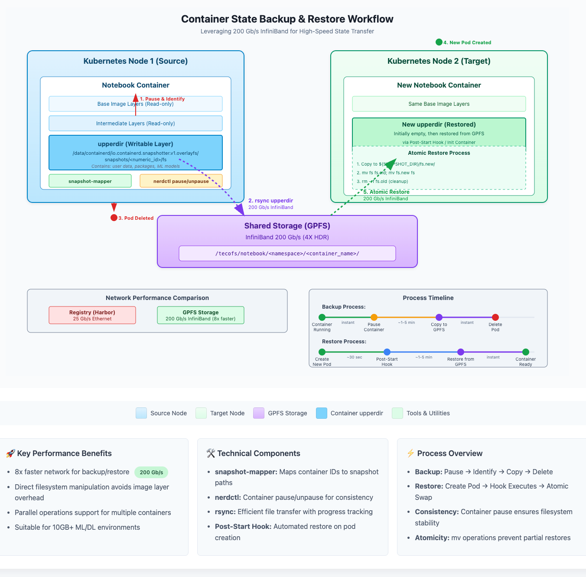
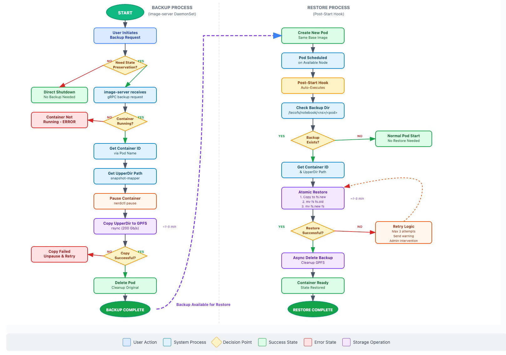

# 一种高效的容器状态备份恢复方案

This document outlines a method for backing up and restoring the state of a running containerd container (specifically its writable layer) in a Kubernetes environment using overlayfs. This approach involves directly copying the contents of the container's `upperdir` to a shared storage location and then restoring it to a new container's `upperdir`.

This method is particularly considered for deep learning workloads, which often involve large environments (CUDA libraries, frameworks, models, datasets) where minimizing state transfer time is beneficial.

**Goal:** To achieve a faster state transfer for a container than a full image commit, push, and pull cycle, by directly manipulating the overlayfs `upperdir`.

## Network Infrastructure Background

The motivation for this approach is driven by the significant performance difference in our network infrastructure:

- **Harbor Image Registry Connection**: 25 Gb/s Ethernet link between Kubernetes hosts and the Harbor image registry
- **GPFS Storage Connection**: InfiniBand 200 Gb/s (4X HDR) link between hosts and GPFS storage

This 8x speed advantage of the GPFS storage link over the image registry connection makes direct filesystem-level backup and restore potentially much faster than traditional OCI image push-and-pull operations, especially for large images common in deep learning workloads (often 10GB+, even 100GB+ with CUDA libraries, frameworks, pre-installed datasets and temp files).

## Conceptual Plan

1.  **Identify Target Container & its `upperdir`:**
    *   Given a running Pod/Container in Kubernetes, identify the specific container instance on the node. This can be done by listing containers on the node (e.g., `nerdctl -n k8s.io ps`) and correlating with Pod information.
    *   Use the `snapshot-mapper id2dir <containerID>` command to find the numeric snapshot ID corresponding to the container's `upperdir`. (Note: `--namespace` for `id2dir` refers to the K8s Pod namespace, used for constructing the runtime task path).
    *   The `upperdir` path will typically be: `/data/containerd/io.containerd.snapshotter.v1.overlayfs/snapshots/<numeric_id>/fs` (adjust base path as per your containerd configuration).

2.  **Backup Phase:**
    *   **Pause Container (Recommended for Consistency):** To help ensure a more consistent filesystem state, pause the target container using `nerdctl`. This freezes the processes within the container.
        *   `nerdctl -n k8s.io pause <containerID_or_name>`
    *   **Copy `upperdir`:** Copy the entire contents of the identified `upperdir` from the node's filesystem to a pre-configured shared storage location (e.g., GPFS mounted on all relevant nodes at `/tecofs`).
        *   Example: `rsync -avp /data/containerd/io.containerd.snapshotter.v1.overlayfs/snapshots/<numeric_id>/fs/ /tecofs/notebook/<namespace>/<container_backup_name>/`
    *   **Unpause Container (If applicable):** If the container is to continue running temporarily after backup before a planned migration:
        *   `nerdctl -n k8s.io unpause <containerID_or_name>`
    *   **Shutdown Original Container/Pod:** After a successful backup (and unpausing if done), the original Pod/Container can be scaled down or deleted according to your migration plan.

3.  **Restore Phase:**
    * **Launch New Container/Pod:** Start a new Pod/Container using the *same base image* as the original. This new container can be scheduled on any node that has access to the shared storage.
    
    *   **Kubernetes Post-Start Hook / Init Container:** To manage the restoration, leverage a Kubernetes [Post-Start Lifecycle Hook](https://kubernetes.io/docs/concepts/containers/container-lifecycle-hooks/#container-hooks) in the new Pod's definition, or an Init Container. This script/container will be responsible for the following steps *on the node where the new Pod is scheduled*:
        *   **Identify New Container's `upperdir`:**
            *   The script needs to discover its own container's ID. This can be tricky; one common way is to get it from the container's hostname if it's set to the Pod name, then describe the pod to find container statuses and IDs, or query the local container runtime.
            *   Alternatively, if the script knows its Pod UID and container name, it could list local containers and filter.
            *   Once the `containerID` is found, use `snapshot-mapper id2dir <new_containerID>` to find its `upperdir` numeric snapshot ID.
            *   **Crucial Point:** The new container will *initially* have an empty or near-empty `upperdir`.
            
        * **Ensure Application Not Running/Writing:** The Post-Start hook runs *before* the main container entrypoint fully starts its primary application process if the entrypoint waits or if the critical application startup is delayed. This provides a window. However, the container filesystem is already mounted. For absolute safety, the application should ideally not attempt significant writes until restoration is complete.
        
        *   **Copy Backup to New `upperdir` (Atomic Restore):**
            To prevent corruption during restore, use atomic operations:
            ```bash
            # Create temporary directory for new content
            SNAPSHOT_DIR="/data/containerd/io.containerd.snapshotter.v1.overlayfs/snapshots/<new_numeric_id>"
            
            # Copy backup to temporary location
            rsync -avp /tecofs/notebook/<namespace>/<container_backup_name>/ ${SNAPSHOT_DIR}/fs.new/
            
            # Atomic swap - backup current, swap in new, cleanup old
            if [ -d "${SNAPSHOT_DIR}/fs" ]; then
                mv ${SNAPSHOT_DIR}/fs ${SNAPSHOT_DIR}/fs.old
            fi
            mv ${SNAPSHOT_DIR}/fs.new ${SNAPSHOT_DIR}/fs
            
            # Cleanup old directory (only after successful swap)
            if [ -d "${SNAPSHOT_DIR}/fs.old" ]; then
                rm -rf ${SNAPSHOT_DIR}/fs.old
            fi
            ```
            
        *   The main container process then starts or continues, ideally finding its state restored.

Complete system architecture with network infrastructure and component interactions



Detailed notebook container state save and resume workflow  


Step-by-step flowchart showing backup and restore decision logic



## Approach Comparison

The following table compares three different approaches for container state backup and restore:

| **Aspect** | **1. Commit-Push-Pull** | **2. Modified Containerd Plugin** | **3. Direct UpperDir Manipulation** |
|------------|-------------------------|-----------------------------------|-------------------------------------|
| **Backup Speed** | ❌ Very Slow (25 Gb/s Ethernet to registry) | ✅ Fast (no backup needed, persistent upperdir) | ✅ Fast (200 Gb/s InfiniBand to GPFS) |
| **Restore Speed** | ❌ Very Slow (25 Gb/s pull from registry) | ✅ Instant (mount existing upperdir) | ✅ Fast (200 Gb/s from GPFS) |
| **Runtime Performance** | ✅ Native NVME performance | ❌ Poor (shared storage network latency) | ✅ Native NVME performance |
| **Network Utilization** | ❌ High registry traffic (25 Gb/s bottleneck) | ⚠️ Continuous I/O over InfiniBand | ⚠️ Burst I/O during backup/restore |
| **Storage Requirements** | ❌ High (full images in registry) | ⚠️ High (persistent upperdir in shared storage) | ⚠️ Medium (backup copies in shared storage) |
| **Implementation Complexity** | ✅ Simple (standard Docker/OCI) | ❌ Very High (custom containerd plugin) | ⚠️ Medium (scripting + privileged operations) |
| **Operational Complexity** | ✅ Low (standard tooling) | ❌ High (custom plugin maintenance) | ⚠️ Medium (custom tooling + monitoring) |
| **Kubernetes Integration** | ✅ Native (standard images) | ⚠️ Requires cluster-wide changes | ⚠️ Pod-level hooks/init containers |
| **Reliability** | ✅ Battle-tested | ❌ Unproven (custom development) | ⚠️ Moderate (depends on implementation) |
| **Rollback Capability** | ✅ Easy (previous image versions) | ⚠️ Limited (manual upperdir management) | ⚠️ Possible (backup versioning) |
| **Multi-tenancy** | ✅ Excellent (isolated images) | ❌ Complex (shared storage permissions) | ⚠️ Good (GPFS path isolation) |
| **Scalability** | ❌ Limited by registry bandwidth | ❌ Limited by shared storage performance | ✅ Good (parallel operations) |
| **Development Effort** | ✅ Minimal | ❌ Months of development | ⚠️ Weeks of development |
| **Maintenance Burden** | ✅ Low | ❌ Very High | ⚠️ Medium |
| **Failure Recovery** | ✅ Robust (retry mechanisms) | ❌ Complex (plugin issues affect cluster) | ⚠️ Moderate (script-level handling) |
| **Data Consistency** | ✅ Snapshot-based consistency | ❌ Live filesystem risks | ⚠️ Pause-based consistency |

### Key Findings:

- **Approach 1 (Commit-Push-Pull)**: Reliable and simple but severely bottlenecked by 25 Gb/s registry connection for large ML images
- **Approach 2 (Modified Plugin)**: Fastest restore but introduces significant runtime performance penalties and development complexity
- **Approach 3 (Direct UpperDir)**: Best balance of performance and complexity, leveraging high-speed GPFS while maintaining native runtime performance

### Recommendation:
For the described infrastructure (200 Gb/s InfiniBand GPFS vs 25 Gb/s registry connection), **Approach 3** provides the optimal trade-off between performance gains and implementation complexity, especially for large deep learning workloads.

## Prerequisites & Assumptions

*   **Containerd with OverlayFS:** Specific to containerd using the overlayfs snapshotter.
*   **Shared Storage:** Reliable shared storage (e.g., GPFS at `/tecofs`) accessible from all potential Kubernetes nodes.
*   **Root Access for Scripts:** The Post-Start hook script or Init Container will effectively need root-equivalent privileges on the node to run `snapshot-mapper` (if it accesses `/proc/mounts` or a node-local DB path) and to `rsync` into the containerd snapshot directories. This typically means running the Pod with a privileged Security Context or a carefully crafted sidecar with necessary permissions.
*   **`snapshot-mapper` Tool:** Available on the nodes or within the Init Container/hook environment.
*   **Same Base Image:** The new container *must* be started from the exact same base image.
*   **Consistent Application State:** The application's ability to handle its state being "transplanted" is critical.
*   **Deep Learning Workloads:** This method assumes that the "state" primarily consists of the filesystem content (libraries, frameworks, datasets, generated model files). In-memory state of training processes is not captured by this method alone.

## `snapshot-mapper` Tool Usage

This utility helps in identifying the numeric snapshot ID for a container's `upperdir`.

*   **To find the `upperdir` numeric ID for a container:**
    ```bash
    snapshot-mapper id2dir <containerID>
    ```
    This will output `<containerID> -> <numeric_snapshot_id>`. The `upperdir` path is then typically `/data/containerd/io.containerd.snapshotter.v1.overlayfs/snapshots/<numeric_snapshot_id>/fs`. (Adjust snapshotter base path as needed).

## Important Considerations & Risks

*   **Data Consistency:**
    *   `nerdctl pause` helps, but complex applications might still have consistency challenges if not designed for this kind of "snapshotting."
    *   For deep learning, if datasets or model checkpoints are being written during the pause/backup, ensure file operations are atomic or complete.
*   **Security Implications:** High privileges are required for the backup and restore operations.
*   **OverlayFS Internals:** Reliance on internal structures.
*   **Kubernetes Integration:**
    *   The Post-Start hook approach is more idiomatic for Kubernetes than manual intervention on the new Pod.
    *   Careful scripting is needed within the hook to correctly identify the `upperdir` and manage permissions.
    *   Error handling in the hook is important. If the restore fails, the Pod might still start with an incomplete state.
*   **Atomicity of Restore:** The restore process (delete old `upperdir` content, rsync new content) is not atomic. If interrupted, the `upperdir` could be in a corrupted state.
*   **Large Files:** Rsyncing large datasets or numerous small files (common in DL) into the `upperdir` can still take time and incur I/O load. The `upperdir` is still a layer on top of other layers; performance characteristics might differ from a native filesystem.
*   **Ephemeral Storage Limitations:** This approach does not limit the ephemeral storage used in the container's upper layer. Kubernetes provides mechanisms to set ephemeral storage limits (`resources.limits.ephemeral-storage`), but when these thresholds are reached, the pod will be killed and evicted, causing workload interruption. Since this backup/restore method potentially increases upperdir usage significantly, careful monitoring and sizing of ephemeral storage limits is critical to prevent unexpected pod evictions.

## Conclusion

Direct `upperdir` manipulation, augmented with container pausing and Kubernetes lifecycle hooks, offers a specialized method for potentially faster state transfer of filesystem-heavy workloads like deep learning environments. It remains a complex procedure with significant risks, especially around data consistency and the need for privileged operations. It should be thoroughly tested and is best suited for scenarios where the application state is primarily file-based, the base image is static, and the overhead of full image management is a proven bottleneck. Always evaluate against standard Kubernetes practices like PersistentVolumes and application-level state management.
